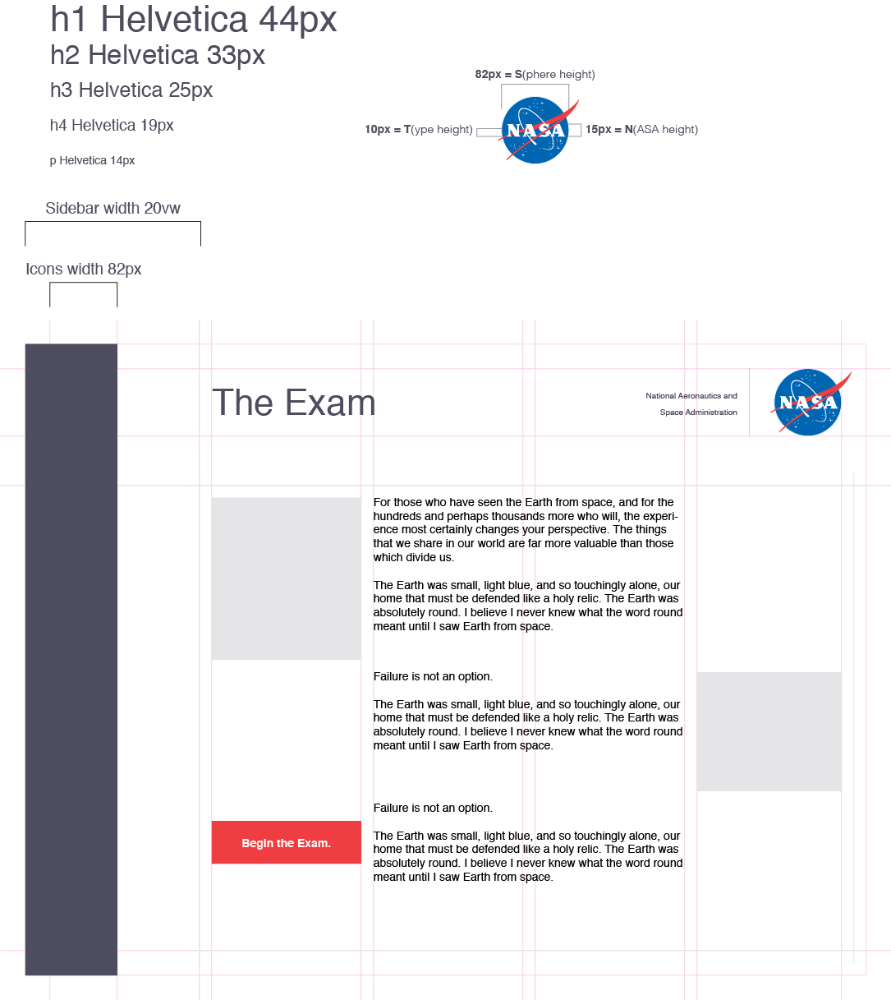
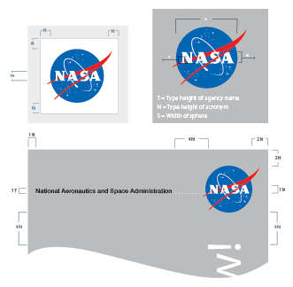
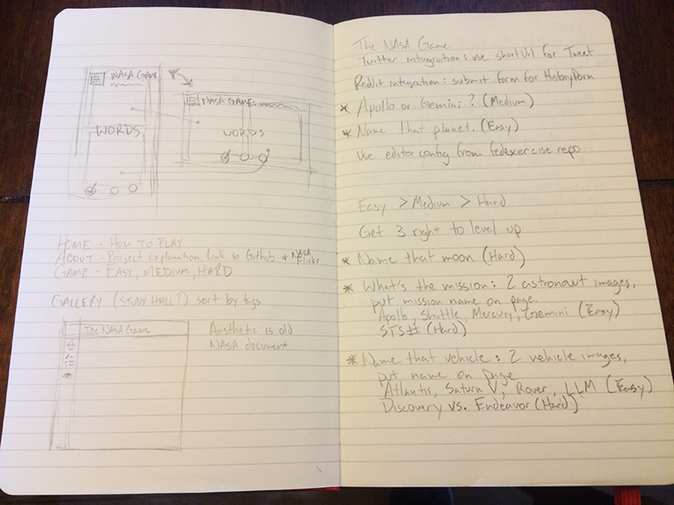
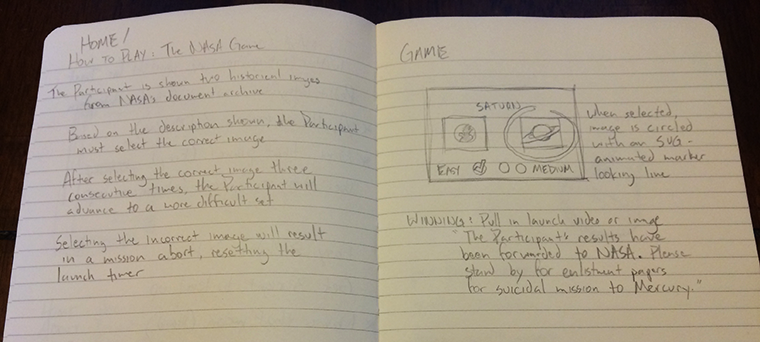

# NASA Goddard Space Flight Center

Here's an overview of my approach for the FEDExercise. Since it's NASA-themed, I wanted to make a more official-looking app. Following branding standards set in [NASA's Style Guide](http://sservi.nasa.gov/wp-content/uploads/2011/10/NASA_Style_Guide_v2.1.pdf), the design even borrowed some of the style-guide's layout techniques.

### App Design & Layout

* * *

* * *

* * *

The page dimensions are based off of the units of measurement defined by the size of the NASA logo. This was a fun approach outlined in the style-guide and it gives the app a consistent, ordered feel.

## The NASA Game

At first glance, my impression was that I'd be tying into the NASA Commons account on Flickr. I was so excited to get to use their images that I thought I'd go off the rails a bit for this project and, instead of just building a search interface and photo gallery, I was going to create a fun game.

The concept was very straight forward, present the user with two different images, display the label or question, and have them select the correct image. As the user completed three consecutive correct answers, the questions would advance from easy (Cadet) to medium (Engineer) to hard (Commander).

I wanted a UI that looked and behaved like a hand-written paper exam from the 50's, with old typewriter text, something that could offer immersion to make up for the game's simplicity.

To accommodate the exercise's guidelines, there would be an image gallery that displayed the images and category tags used in the main app. Basically a study hall for the exam.

### But

...then I plugged in the user ID for the exercise and discovered that the images were from a different Flickr account :\

It was pretty close to being salvageable, but in the end, the more administrative and technical format of GSFC's images just didn't fit the mold of what I had designed. Another strike against my concept were the poorly curated tags used in both Flickr accounts. For instance, it's impossible to reliably compare two different planets because they all share names and Flickr tags with other NASA projects (Mercury being a good example).

## Goddard Space Flight Center

No big deal. By that point I had the majority of my layout styled and coded up, so I pushed ahead. To make up for not making a sleeker design, I went with a more sophisticated architecture. There are two versions, and while the full functionality isn't fleshed out yet, I'm happy with the foundations laid out in both.

Both versions focus on the single responsibility principle. I'm not a fan of technical debt for the sake of pushing out product, and these apps are good examples of creating a framework that will allow future integrations without having to predict what those might be.

Creating JavaScript Classes and independent Components comes with more up-front work, but saves all the time later on with code reusability.

### vanilla JavaScript

[The first version](http://nominalaeon.github.io/nasa-gsfc-js/) of the app is straight-up JavaScript using a couple of open-source tools I developed beforehand, including [FrenchDipJS](http://nominalaeon.github.io/french-dip/).

### AngularJS

[The second version](http://nominalaeon.github.io/nasa-gsfc/) is built with Angular 1.5. The app winds up in pretty deep DOM-manipulation waters when it has to pull in fresh image assets from the API. Angular just makes too much sense to avoid for a project like this. Still, the architecture is a Class-based concept I've been perfecting for my last few projects and this is probably my favorite implementation so far.

